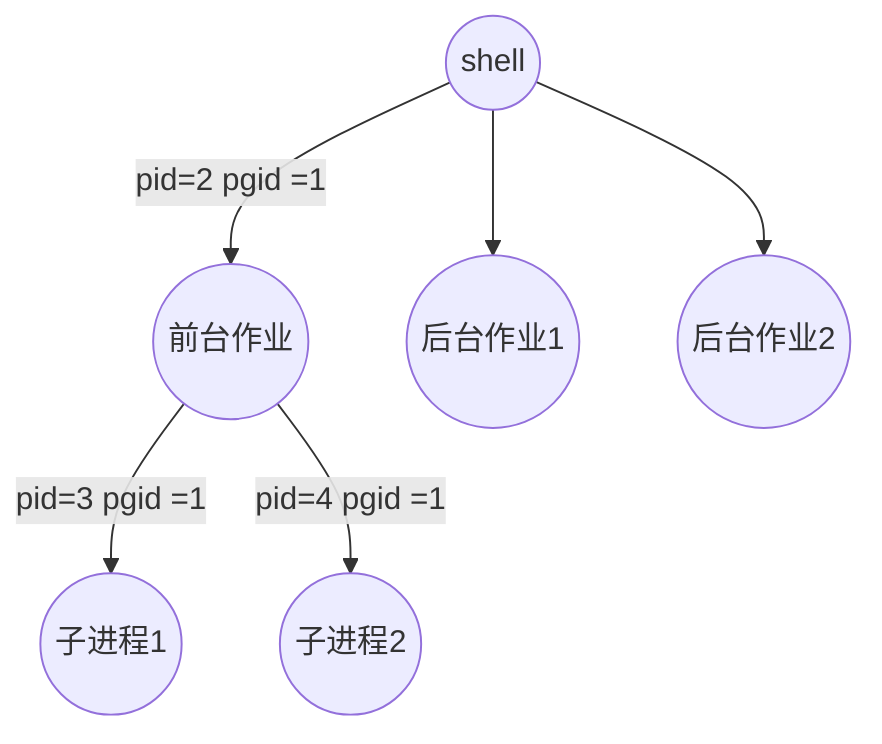

# csapp----test
csapp相关练习与笔记

[第八章笔记](/chapter-8/Readme.md)

## 第八章

### 进程
进程的经典定义是一个执行中程序的实例，每个进程都运行在对应的上下文(环境条件)之中
pc(程序计数器)的序列成为逻辑流，即程序应该执行的顺序.
逻辑流有好多形式，比如：异常处理程序，进程，信号处理程序，线程..
一个逻辑刘在执行时间上与另一个流重叠被称为并发流
+ 并发并不一定非得是进程之间，还可以是程序与信号处理函数之间(l流之间)
+ 多个流并发执行成为并发
+ 一个进程和其他进程轮流运行的概念成为多任务
+ **并行**发生在多个处理器之上
+ 正常的函数调用不能被看作是并发，是因为其本身就是一个逻辑流

进程为每个程序提供自己的私有地址空间
### 信号
> linux 信号是一种更高层次的软件形式的异常，它允许进程和内核中断其他进程

#### 1.信号术语
+ 发送信号:
     + 内核通过更新目的进程上下文之中的某个状态发送信号
     + 一个进程可以发送信号给自己
     + 发送一个信号可以有以下原因:
     a. 内核检测到系统时间，比如除以0错误i
     b. 一个进程调用kill函数
+ 接受信号:
    +  当目的进程被内核强迫以某种方式对信号的发送作出反应时，接受了信号。
    +  进程可以忽略这个信号，终止或者通过执行`信号处理程序`来进行处理信号。
    +  待处理信号: 只能有一种，可以被阻塞(也就是不被接受，但是可以发出信号) 

#### 2.发送信号
1. 进程组:
     + 每一个进程都只属于一个进程组，用进程组ID来标识 
     + 默认子进程与父进程属于一个进程组
     ```cpp
     #include<unistd.h>
     pid_t getpgrp(void) //返回当前进程的进程组ID

     int setpgid(pid_t pid,pid_t pgid); // 改变进程组 pid进程组->pgid ， 若pgid 为0，用pid指定的PID作为id
     ```
2. 用/bin/kill 程序发送信号
    +  `linux> /bin/kill -9 15213` --发送信号9到15213之中
    +  `linux> /bin/kill -9 -15213` --负代表进程组
3.  从键盘发出信号
    + shell 用job来表示对一条命令行求值创建的进程
    + 任何时刻至多有一个前台作业和多个后台作业

4. 用kill函数发送信号给其他进程
```cpp
#include<sys/types.h>
#include<signal.h>

int kill(pid_t pid ,int sig); // kill发送sig信号给pid的进程，pid为0 发给当前进程组所有进程
```
示例: kill.c
kill 程序不会输出呢一段话，因为提前结束了进程

5. 用alarm函数发送信号
向自己发送`SIGALRM`  （终止）信号
```cpp
#include<unsitd.h>

//在secs秒之后给自己发送一个SLFALRM信号
unsigned int alarm(unsigned int secs);
```
示例:alarm.c -- 注意**回收进程**的方式，否则会发生父进程结束但是子进程结束的情况

#### 接受信号
当内核把进程p从内核模式切换到用户模式时(例如完成了一次上下文切换)，会检查还没有被处理的，非被阻塞的信号，选择之中(通常是最小的)信号进行接受并且处理，之后会控制传回p进程的下一个指令(I~next~)。每个信号都有一个默认行为
+ 进程终止
+ 进程终止并且转储内存
+ 进程挂起，知道被SIGCONT信号重启
+ 进程忽略该进程

signal 函数可以改变信号的默认行为(除了SIGSTOP,SIGKILL)
改变默认行为变为自定义之后，这个信号就可以调用自定义的信号处理函数来进行处理信号。

```cpp
#include<signal.h>
typedef void (*sighandler_t)(int);

sighander_t signal(int signum,sighandler_t handler);
//返回成功即之乡处理程序的指针，出错为SIG_ERR
```

+ 如果handler == SIG_IGN 忽略信号类型为signum的信号
+ 如果handle == SIG_DFL signum信号恢复默认行为
+ handler是用户自定义的函数的地质，这个函数被称为信号处理函数，当得到目标信号之后，进程会运行该喜好处理函数 ==设置信号处理程序==

**示例**

>sigint.c展示了重写Ctrl+c的SIGINT信号，使其变为一个函数，运行该信号处理函数。

信号处理程序可以被其他的信号处理程序中断，比如从主函数获得信号s跳转到S进程，但是S在运行时程序捕捉信号t！=s,会转移到T程序处理信号t，之后在到S之中执行，最后返回主进程。

当信号处理函数返回，即return 时，会从中断处接着运行，即中断的指令不会重新运行

#### 4. 阻塞和基础阻塞信号
linux 提供显示与隐式的机制
#### 5.编写信号处理程序
1. 安全的信号处理
 由于信号处理程序和其他主程序以及其他信号处理程序并发的运行，可能导致一些安全问题。以下是一些安全编写的原则:
    + 处理程序要尽可能的简单(可以简单的设置全局变量并且返回)
    + 在处理程序之中只调用异步信号安全的函数(要么可重入，要么不能被信号处理程序中断)（write函数是信号处理函数安全输出的唯一方法）
    + 保存和恢复 errno。
    + 阻塞所有的信号(防止信号处理函数被中断)，保护对共享全局数据结构的访问
    + 用volatile声明全局变量(强迫编译器每次在引用g时都要从内存之中读取g)
    + 用sig_atomic_t声明标志。 -- volatile sig_atomic_t flag; 全局变量标志记录收到了信号
2. 正确的信号处理
>如果存在一个未处理的信号就表明至少有一个信号到达了

> 不可用信号来对其他进程中发生的事件计数

比如有三个子程序等待回收，如果我们想着每一次接受到信号再进行处理，回收3个程序会发生什么事情呢?
+ 一个子程序停止信号发出被接受，主程序挂起，进入信号处理函数
+ 第二个子程序发出信号，但是由于正在信号处理函数之中，会被阻塞
+ 第三个子程序发出信号，但是以及存在了第二个程序发出的信号，所以第三个信号会消失

**示例**

signal.c -- 用于创建3个进程，一次尽可能多的处理信号。

3.可移植的信号处理
sigaction函数允许用户在设置信号处理时，明确他们想要的信号处理语义。

Signal 包装函数设置了一个信号处理程序，其语义如下:

+ 只有这个处理程序当前正在处理的呢类信号会被阻塞
+ 信号不会排队等待
+ 一旦设置了信号处理程序，一直保持，知道SIgnal带着handler参数为 SIG_IGN或者 SIG_DFL被调用

#### 6.  同步流以避免讨厌的并发错误

由于并发就是多个逻辑流之间跳来跳去，所以会导致程序可能不会按照我们希望的顺序执行导致了程序之间的竞争关系

一般可以通过阻塞信号来处理并发错误

#### 7. 显示的等待信号
有的时候主程序需要显示地等待某个信号处理程序运行

**示例**:
>父进程设置SIGINT和SIGCHLD的处理程序，然后进入一个无限循环，阻塞SIGCHLD信号,避免竞争的出现.

sigsupend.c
