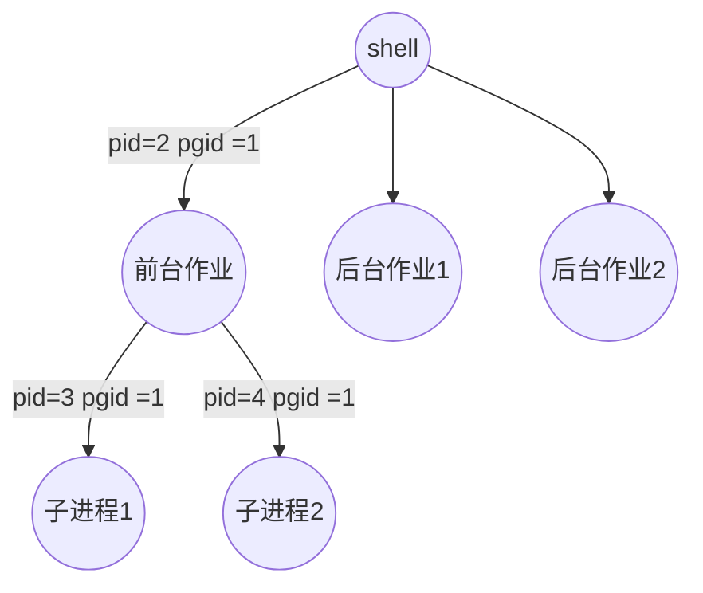

# csapp----test
csapp相关练习与笔记


## 第八章


### 信号
> linux 信号是一种更高层次的软件形式的异常，它允许进程和内核中断其他进程

#### 1.信号术语
+ 发送信号:
     + 内核通过更新目的进程上下文之中的某个状态发送信号
     + 一个进程可以发送信号给自己
     + 发送一个信号可以有以下原因:
     a. 内核检测到系统时间，比如除以0错误i
     b. 一个进程调用kill函数
+ 接受信号:
    +  当目的进程被内核强迫以某种方式对信号的发送作出反应时，接受了信号。
    +  进程可以忽略这个信号，终止或者通过执行`信号处理程序`来进行处理信号。
    +  待处理信号: 只能有一种，可以被阻塞(也就是不被接受，但是可以发出信号) 

#### 2.发送信号
1. 进程组:
     + 每一个进程都只属于一个进程组，用进程组ID来标识 
     + 默认子进程与父进程属于一个进程组
     ```cpp
     #include<unistd.h>
     pid_t getpgrp(void) //返回当前进程的进程组ID

     int setpgid(pid_t pid,pid_t pgid); // 改变进程组 pid进程组->pgid ， 若pgid 为0，用pid指定的PID作为id
     ```
2. 用/bin/kill 程序发送信号
    +  `linux> /bin/kill -9 15213` --发送信号9到15213之中
    +  `linux> /bin/kill -9 -15213` --负代表进程组
3.  从键盘发出信号
    + shell 用job来表示对一条命令行求值创建的进程
    + 任何时刻至多有一个前台作业和多个后台作业

4. 用kill函数发送信号给其他进程
```cpp
#include<sys/types.h>
#include<signal.h>

int kill(pid_t pid ,int sig); // kill发送sig信号给pid的进程，pid为0 发给当前进程组所有进程
```
示例: kill.c
kill 程序不会输出呢一段话，因为提前结束了进程

5. 用alarm函数发送信号
向自己发送`SIGALRM`  （终止）信号
```cpp
#include<unsitd.h>

//在secs秒之后给自己发送一个SLFALRM信号
unsigned int alarm(unsigned int secs);
```
示例:alarm.c -- 注意**回收进程**的方式，否则会发生父进程结束但是子进程结束的情况